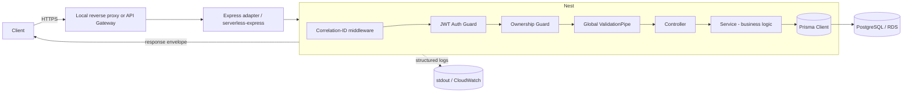
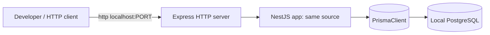
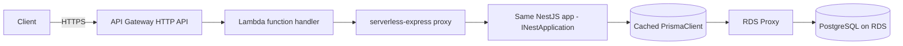
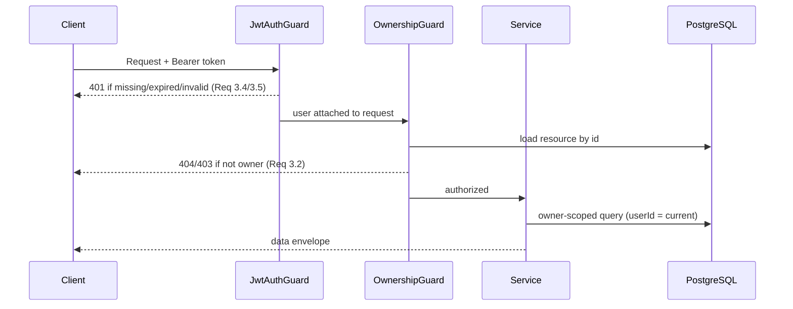
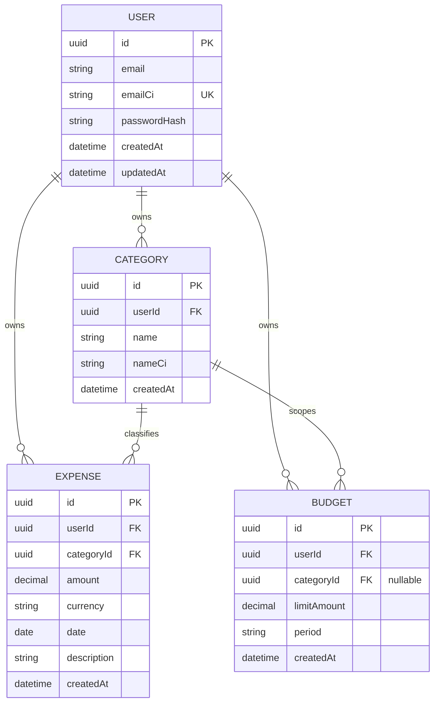

# Design Document

## Overview

The Smart Expense Insights Platform is a production-quality expense management API built on **NestJS + Express (TypeScript)**, backed by **PostgreSQL via Prisma**, and deployable both as a conventional local HTTP server and as an **AWS Lambda function behind API Gateway** from a **single, non-divergent codebase**.

This design is derived directly from the approved `requirements.md`. It maps each architectural decision back to the requirements it satisfies and, where the requirements are silent, it clearly labels reasonable engineering recommendations rather than inventing hard requirements.

### How the design ties back to requirements

| Requirement theme | Requirements | Design response |
| --- | --- | --- |
| Secure registration & credential storage | Req 1 | Auth module, bcrypt/argon2 hashing with per-user salt, class-validator DTOs |
| Login, tokens, lockout | Req 2 | Passport-JWT, 3600s expiry, DB-backed login-attempt tracking + lockout |
| Authorization & data isolation | Req 3 | JWT auth guard + ownership guard + owner-scoped queries |
| Expense CRUD | Req 4–7 | Expenses module, Decimal money type, validation pipes |
| Category management | Req 8 | Categories module, case-insensitive per-user uniqueness, delete-with-dependency guard |
| Budgets & tracking | Req 9–10 | Budgets module, period-window computation, status evaluation |
| Analytics & insights | Req 11 | Analytics module, owner-scoped SUM aggregation, zero-on-empty |
| Request validation | Req 12 | Global `ValidationPipe` (`whitelist` + `forbidNonWhitelisted`) |
| Error handling | Req 13 | Consistent error envelope, global exception filter, transaction rollback |
| Logging & observability | Req 14 | Structured JSON logging, correlation id, secret redaction |
| Config management | Req 15 | `@nestjs/config` with fail-fast schema validation |
| Deployment portability | Req 16, C1–C6 | serverless-express adapter, environment detection, SAM |
| Automated testing | Req 17 | Jest + Supertest + fast-check, single command runner |
| API documentation | Req 18 | OpenAPI/Swagger generated from decorators |

### Scope and non-goals (from Assumptions)

- Single principal per account; multi-user shared-account permissions are out of scope (A1).
- Currency is recorded per expense; no currency conversion (A2).
- All date grouping uses one configured platform time zone unless a per-user zone is later introduced (A3).
- TLS termination is provided by the hosting environment / API Gateway (A4).
- The platform is API-only; clients own their UI (A5).

---

## Architecture

### Overall Application Architecture

The platform uses a **layered, modular NestJS architecture**. Each domain (auth, users, categories, expenses, budgets, analytics) is a self-contained module with its own controller (HTTP boundary), service (business logic), and DTOs (validation contract). Cross-cutting concerns (validation, error mapping, logging, auth) are handled by global pipes, filters, interceptors, and guards so that every endpoint behaves consistently (satisfies Req 12.1, Req 13.1, Req 14.1).

#### Request flow



Order of concerns per request:
1. **Correlation-ID middleware** — attaches/generates a correlation id (Req 14.6).
2. **Logging interceptor** — records method, route, status, timestamp (Req 14.1).
3. **JWT auth guard** — rejects missing/expired/malformed tokens (Req 2.5, 2.6, 3.4, 3.5).
4. **Ownership guard / owner-scoped queries** — enforces Data_Isolation (Req 3.1–3.3).
5. **Global ValidationPipe** — validates DTOs before business logic (Req 12.1–12.4).
6. **Controller → Service → Prisma** — executes the operation.
7. **Global exception filter** — maps any error to the consistent envelope (Req 13.1–13.3).

#### Layer responsibilities

- **Controllers**: HTTP routing, binding, delegate to services. No business logic.
- **Services**: business rules, orchestration, transactions, ownership enforcement in queries.
- **Repositories**: Prisma access is encapsulated behind services (thin repository via `PrismaService`).
- **DTOs**: the validation and serialization contract (class-validator / class-transformer).
- **Guards / Interceptors / Filters / Pipes**: cross-cutting behavior applied globally.

---

### NestJS + Express Structure

#### Modules

| Module | Responsibility | Key requirements |
| --- | --- | --- |
| `AppModule` | Root wiring, global providers, config import | Req 15 |
| `ConfigModule` (`@nestjs/config`) | Load + validate env | Req 15.1–15.5 |
| `PrismaModule` | `PrismaService` lifecycle, connection management | C3, Req 16.4 |
| `AuthModule` | Registration, login, token issuance, lockout | Req 1, 2 |
| `UsersModule` | User persistence, credential records | Req 1 |
| `CategoriesModule` | Category CRUD, uniqueness, dependency guard | Req 8 |
| `ExpensesModule` | Expense CRUD, filtering, pagination | Req 4–7 |
| `BudgetsModule` | Budget CRUD, tracking/status | Req 9, 10 |
| `AnalyticsModule` | Monthly/category insights | Req 11 |
| `HealthModule` | Liveness/DB readiness | Req 16.4 |
| `CommonModule` | Shared filters, interceptors, guards, decorators | Req 12, 13, 14 |

#### Providers, guards, interceptors, pipes, filters

- **Providers**: domain services, `PrismaService`, `TokenService`, `PasswordHasher`, `LockoutService`, `LoggerService`.
- **Guards**:
  - `JwtAuthGuard` (global, opt-out via `@Public()` for register/login/docs) — Req 3.4, 3.5.
  - `OwnershipGuard` (route-level for `/:id` resources) — Req 3.1, 3.2.
- **Interceptors**:
  - `LoggingInterceptor` — structured request/response logs + correlation id (Req 14.1–14.3).
  - `ResponseEnvelopeInterceptor` — wraps successful payloads in the consistent envelope (Req 13.1).
- **Pipes**:
  - Global `ValidationPipe({ whitelist: true, forbidNonWhitelisted: true, transform: true })` — Req 12.1–12.4.
- **Filters**:
  - `AllExceptionsFilter` — maps every error to the error envelope, strips internals (Req 13.1–13.3).
- **Middleware**:
  - `CorrelationIdMiddleware` — Req 14.6.

---

### Local Development Architecture

Local execution (Req 16.1, 16.2, C2, C5):



- **Bootstrap**: `main.ts` calls `app.listen(PORT)` when `RUNTIME_ENV=local`. If the port is in use, startup aborts with a clear binding error (Req 16.2).
- **Database**: local PostgreSQL (Docker Compose recommended — labeled recommendation, requirements are silent on the exact local provisioning method).
- **Config**: `.env` loaded by `@nestjs/config`; schema-validated at startup, fails fast on missing/invalid values (Req 15.1–15.5).
- **Hot reload**: `nest start --watch` for local iteration (developer command; not run by the agent).
- **Seeding**: `prisma/seed.ts` provides deterministic seed data for local dev and tests (recommendation).
- **DB connect timeout**: connection attempts bounded to 10s; failures surface a database-unavailability error (Req 16.4).

Recommended local commands (run manually by the developer):
- `npm run start:dev` — watch-mode server.
- `npm run prisma:migrate:dev` — apply migrations.
- `npm run db:seed` — seed data.

---

### AWS Lambda + API Gateway Architecture

The same Nest application bootstraps for both environments using a **serverless-express adapter** (`@codegenie/serverless-express`, the maintained successor to `@vendia/serverless-express`) (satisfies C4, C5, Req 16.3, 16.5).



#### Single-codebase bootstrap

```ts
// main.ts (illustrative)
let cachedServer: Handler;

async function bootstrapServer(): Promise<Handler> {
  const app = await NestFactory.create(AppModule);
  configureApp(app);           // global pipes/filters/interceptors — shared by BOTH paths
  await app.init();            // note: init(), NOT listen()
  const expressApp = app.getHttpAdapter().getInstance();
  return serverlessExpress({ app: expressApp });
}

// Lambda entry point
export const handler = async (event, context) => {
  cachedServer ??= await bootstrapServer();
  return cachedServer(event, context);
};

// Local entry point (when RUNTIME_ENV=local)
async function bootstrapLocal() {
  const app = await NestFactory.create(AppModule);
  configureApp(app);
  await app.listen(config.PORT);
}
```

`configureApp()` is the single source of truth for global pipes/filters/interceptors so behavior is identical across environments (Req 16.5).

#### Cold start handling

- The `INestApplication` and the `serverlessExpress` server are **cached in module scope** and reused across warm invocations, so `NestFactory.create()` and Prisma connection happen once per container.
- Cold-start cost is dominated by Nest bootstrap + Prisma engine load + first DB connection. Mitigations: keep dependency graph lean, use provisioned concurrency for latency-sensitive deployments (labeled recommendation — requirements do not mandate a latency target for Lambda cold start; Req 2.1's 2s applies to token issuance under warm/normal conditions and is a design target, see risks §22).

---

### PostgreSQL + Prisma Design

Satisfies C3, C6, Req 16.4.

#### Schema and migrations

- Single `prisma/schema.prisma` defines `User`, `Category`, `Expense`, `Budget` and enums.
- Migrations managed with Prisma Migrate: `migrate dev` locally, `migrate deploy` for non-interactive environments (CI/AWS).
- Money stored as `Decimal @db.Decimal(12,2)` to preserve two-decimal precision without floating-point error (satisfies Req 4.1/4.2, 6.1/6.2, 9.1/9.3, 11.5). `12,2` covers the max `999,999,999.99`.

#### Connection management in Lambda

- **PrismaClient is instantiated once and cached** in module scope; reused across warm invocations to avoid per-request connection churn.
- Because each Lambda container holds its own connection(s), high concurrency can exhaust Postgres connection limits. **Recommendation: use Amazon RDS Proxy** to pool and multiplex connections, protecting RDS from connection storms (labeled recommendation; requirements are silent, but C6 + serverless concurrency make this a real risk — see §22).
- Alternatively, direct connections with a small per-client pool (`connection_limit=1..3`) plus RDS Proxy is the recommended combination for Lambda.
- Connection attempts bounded to a 10s timeout so a stuck connection returns a database-unavailability error rather than hanging (Req 16.4).

#### PrismaService

```ts
@Injectable()
export class PrismaService extends PrismaClient implements OnModuleInit, OnModuleDestroy {
  async onModuleInit() { await this.$connect(); }
  async onModuleDestroy() { await this.$disconnect(); }
}
```
In Lambda, `onModuleDestroy` is generally not invoked between warm invocations, which is desirable (keep the connection warm).

---

## Components and Interfaces

### API Design and Versioning

#### Conventions

- **URI versioning**: all resources under `/api/v1` (NestJS `URI` versioning). Enables non-breaking evolution (supports Req 18.3, 18.4).
- **REST resource design** with plural nouns and standard verbs.
- **Consistent response envelope** for success and error (Req 13.1):

```jsonc
// success
{ "success": true, "data": { /* resource or list */ }, "meta": { "correlationId": "…", "pagination": { "limit": 20, "offset": 0, "total": 57 } } }
// error
{ "success": false, "error": { "code": "VALIDATION_ERROR", "message": "…", "details": [ { "field": "amount", "reason": "out_of_range" } ] }, "meta": { "correlationId": "…" } }
```

#### Endpoint map

| Resource | Method & path | Requirement |
| --- | --- | --- |
| Register | `POST /api/v1/auth/register` | Req 1 |
| Login | `POST /api/v1/auth/login` | Req 2 |
| Create expense | `POST /api/v1/expenses` | Req 4 |
| List expenses | `GET /api/v1/expenses?startDate&endDate&categoryId&limit&offset` | Req 5 |
| Get expense | `GET /api/v1/expenses/:id` | Req 5 |
| Update expense | `PATCH /api/v1/expenses/:id` | Req 6 |
| Delete expense | `DELETE /api/v1/expenses/:id` | Req 7 |
| Create category | `POST /api/v1/categories` | Req 8 |
| List categories | `GET /api/v1/categories` | Req 8.4 |
| Update category | `PATCH /api/v1/categories/:id` | Req 8.5 |
| Delete category | `DELETE /api/v1/categories/:id` | Req 8.7, 8.8 |
| Create budget | `POST /api/v1/budgets` | Req 9 |
| List budgets | `GET /api/v1/budgets` | Req 9.6 |
| Update budget | `PATCH /api/v1/budgets/:id` | Req 9.7 |
| Delete budget | `DELETE /api/v1/budgets/:id` | Req 9.8 |
| Budget status | `GET /api/v1/budgets/:id/status` | Req 10 |
| Monthly insight | `GET /api/v1/analytics/monthly?month=YYYY-MM` | Req 11.1 |
| Category insight | `GET /api/v1/analytics/by-category?startDate&endDate` | Req 11.2 |
| Health | `GET /api/v1/health` | Req 16.4 |
| Docs | `GET /api/v1/docs` (OpenAPI) | Req 18 |

#### Pagination & filtering

- `limit` 1–100 (default 20), `offset` ≥ 0 (default 0); out-of-range → validation error (Req 5.5, 5.10).
- Date-range filter inclusive on both boundaries (Req 5.3); category filter owner-scoped (Req 5.4).
- List default ordering: expense date descending (Req 5.2).

---

### Authentication and Authorization

#### Registration & password storage (Req 1)

- DTO validation: RFC 5322 email (3–254 chars), password 8–128 chars with upper/lower/digit/special (Req 1.1, 1.3, 1.4).
- Case-insensitive email uniqueness enforced by a normalized `email_ci` unique index (Req 1.2).
- Password hashing with **argon2id** (recommended) or bcrypt; both generate a **unique per-user salt** embedded in the stored hash. Plaintext is never stored (Req 1.5).

#### Login & tokens (Req 2)

- Credentials verified against stored hash; generic error that never discloses which field failed (Req 2.2).
- Missing/empty email or password → validation error before verification (Req 2.3).
- On success, issue a **JWT** signed with the configured secret; `exp = iat + 3600s` (Req 2.4). Token issuance targeted within 2s (Req 2.1) — hashing work factor tuned to stay within budget.
- Expired token → auth error (Req 2.5); malformed/unverifiable token → auth error (Req 2.6).

#### Lockout (Req 2.7)

- Track failed attempts per (normalized email) with timestamps.
- After **5 consecutive failures within a 15-minute window**, reject further attempts for **900s** with a "temporarily locked" auth error.
- **State store**: because Lambda is stateless and multi-container, lockout state MUST live in a shared store. **Recommendation: persist attempt counters in PostgreSQL** (a `LoginAttempt`/lock table) so behavior is identical local and on AWS; a managed cache (e.g., ElastiCache/DynamoDB) is an alternative if latency demands it (labeled recommendation — see §22).

#### Authorization / data isolation (Req 3)

- Global `JwtAuthGuard` requires a valid token on all non-public routes (Req 3.4, 3.5).
- **Ownership enforcement** is applied two ways:
  - **Owner-scoped queries**: every read/write filters by `userId = currentUser.id`, so collections only ever contain the owner's records and return `[]` otherwise (Req 3.3, 5.2, 8.4, 9.6, 11.3).
  - **OwnershipGuard** for single-resource routes: a non-owner request is rejected without disclosing existence or contents (Req 3.2, 5.8, 6.6, 7.3). To avoid leaking existence, "not owner" and "not found" both map to a not-found/authorization response as the requirements specify per operation.
- Authorization decisions target < 500ms (Req 3.1), achieved via indexed `userId` lookups.



---

### Expense, Category, Budget, and Analytics Modules

#### ExpensesModule (Req 4–7)
- **Controller**: CRUD + list endpoints.
- **Service**: validates category ownership on create/update (Req 4.3, 6.4); enforces amount range/precision via DTO; applies filters, pagination, ordering; owner-scoped deletes.
- **DTOs**: `CreateExpenseDto`, `UpdateExpenseDto`, `ListExpensesQueryDto`.
- **Key logic**: amount `> 0.00 … ≤ 999,999,999.99`, exactly/at-most two decimals; `date` a valid calendar date not in the future (Req 4.5); optional description ≤ 500 chars (Req 4.6).

#### CategoriesModule (Req 8)
- **Service**: trims name; enforces 1–100 chars; case-insensitive per-user uniqueness (Req 8.1–8.3); blocks deletion when referenced by expenses (Req 8.7); deletes when unreferenced (Req 8.8).
- **DTOs**: `CreateCategoryDto`, `UpdateCategoryDto`.

#### BudgetsModule (Req 9–10)
- **Service (management)**: limit `0.01…999,999,999.99` ≤ 2 decimals; period ∈ {weekly, monthly, yearly}; optional category scope owned by user (Req 9.1–9.5).
- **Service (tracking)**: computes total spend within the budget period window and scope, `remaining = limit − total`; status `within-limit` when `0 ≤ total ≤ limit`, else `exceeded` with `exceeded = total − limit`; zero-spend returns total 0 / remaining = limit / within-limit (Req 10.1–10.5).
- **Period window**: derived from the configured platform time zone (A3).

#### AnalyticsModule (Req 11)
- **Service**: owner-scoped SUM aggregation.
  - Monthly: sum of amounts dated within the month (Req 11.1).
  - By-category: grouped SUM within a time range (Req 11.2).
  - Empty match → all totals zero, no error (Req 11.4).
  - Deleted expenses excluded from post-deletion computations naturally (Req 7.4).
- **Precision**: aggregation performed on `Decimal` to preserve the sum invariant to within 0.01 (Req 11.5, 17.5).

---

## Data Models

### Entities

- **User**: `id (uuid pk)`, `email (citext-like normalized)`, `emailCi (unique)`, `passwordHash`, `createdAt`, `updatedAt`.
- **Category**: `id`, `userId (fk→User)`, `name`, `nameCi`, `createdAt`, `updatedAt`. Unique `(userId, nameCi)` (Req 8.1, 8.3).
- **Expense**: `id`, `userId (fk→User)`, `categoryId (fk→Category)`, `amount Decimal(12,2)`, `currency (char3)`, `date`, `description (≤500, nullable)`, `createdAt`, `updatedAt`.
- **Budget**: `id`, `userId (fk→User)`, `categoryId (fk→Category, nullable)`, `limitAmount Decimal(12,2)`, `period (enum weekly|monthly|yearly)`, `createdAt`, `updatedAt`.
- **LoginAttempt** (recommendation for lockout state): `email`, `failedCount`, `windowStart`, `lockedUntil` — shared store for Req 2.7.

### Constraints & indexes

- Unique: `User.emailCi` (Req 1.2); `Category (userId, nameCi)` (Req 8.3).
- FKs: `Expense.userId`, `Expense.categoryId`, `Budget.userId`, `Budget.categoryId`.
- `Category` deletion restricted while referenced by `Expense` (`onDelete: Restrict`) to satisfy Req 8.7.
- Indexes for query/analytics performance (Req 3.1, 5.2/5.3/5.4, 11.1/11.2):
  - `Expense (userId, date)` — list ordering + monthly range.
  - `Expense (userId, categoryId)` — category filter + by-category insight.
  - `Budget (userId)`, `Category (userId)`.
- Money as `Decimal(12,2)` everywhere (Req 4, 6, 9, 11 precision).

### ER diagram



---

## Correctness Properties

*A property is a characteristic or behavior that should hold true across all valid executions of a system — essentially, a formal statement about what the system should do. Properties serve as the bridge between human-readable specifications and machine-verifiable correctness guarantees.*

These properties were derived from the prework analysis of the acceptance criteria and consolidated to remove redundancy. Each will be implemented as a **single property-based test** (minimum 100 iterations) using `fast-check`. Non-property criteria (timing bounds, infrastructure, docs) are covered by example/integration/smoke tests in the Testing Strategy (§13).

### Property 1: Analytics sum invariant (monthly)

*For any* set of expenses owned by a user, the monthly spending insight for a given month SHALL equal the arithmetic sum of the amounts of that user's expenses dated within that month, with equality evaluated to a tolerance of 0.01 currency units.

**Validates: Requirements 11.1, 11.5, 17.5**

### Property 2: Analytics sum invariant (by category)

*For any* set of expenses owned by a user and any time range, each category group total in the category-based insight SHALL equal the arithmetic sum of the amounts of that user's expenses in that category within the range, to a tolerance of 0.01.

**Validates: Requirements 11.2, 11.5**

### Property 3: Deletion excludes from analytics

*For any* set of expenses and any single expense deleted from it, every subsequently computed insight total that previously included the deleted expense SHALL decrease by exactly that expense's amount (to a tolerance of 0.01).

**Validates: Requirements 7.4, 11.5**

### Property 4: Empty analytics yields zero

*For any* requested month or range for which the user has no matching expenses, every returned insight total SHALL be zero and no error SHALL be returned.

**Validates: Requirements 11.4**

### Property 5: Invalid analytics range rejected

*For any* analytics request whose range is missing, malformed, or has a start date later than its end date, the request SHALL be rejected with an invalid-range error and no insight SHALL be computed.

**Validates: Requirements 11.6**

### Property 6: Data isolation (single-resource access and mutation)

*For any* two distinct users A and B and any Expense, Category, or Budget owned by A, a request by B to read, update, or delete that resource SHALL be denied, SHALL return no data belonging to A, and SHALL leave the resource unchanged.

**Validates: Requirements 3.1, 3.2, 5.8, 6.6, 7.3, 8.6, 9.9, 10.4**

### Property 7: Data isolation (collections)

*For any* dataset containing records from multiple users, a list/collection response returned to a given user SHALL contain only records owned by that user, and SHALL be empty when the user owns none.

**Validates: Requirements 3.3, 5.2, 8.4, 9.6, 11.3**

### Property 8: Authentication required

*For any* protected route, a request presenting no Authentication_Token SHALL be rejected with an authentication-required error and SHALL NOT perform the requested operation.

**Validates: Requirements 3.4, 5.9**

### Property 9: Invalid token rejected

*For any* Authentication_Token that is expired, malformed, or has an invalid signature, a request presenting it SHALL be rejected with an authentication error and SHALL NOT perform the requested operation.

**Validates: Requirements 2.5, 2.6, 3.5**

### Property 10: Token expiry is exactly 3600 seconds

*For any* successful login, the issued token's expiration SHALL be exactly 3600 seconds after its issuance time.

**Validates: Requirements 2.4**

### Property 11: Login errors do not disclose the failing field

*For any* login attempt with a wrong email versus a wrong password, the rejection error code and message SHALL be identical (no disclosure of which field was incorrect).

**Validates: Requirements 2.2**

### Property 12: Login lockout after threshold

*For any* email, after 5 consecutive failed login attempts within a 15-minute window, all subsequent login attempts for that email (including with correct credentials) SHALL be rejected with a temporarily-locked error for 900 seconds.

**Validates: Requirements 2.7**

### Property 13: Password stored only as a unique salted hash

*For any* password, the stored credential SHALL NOT equal the plaintext, SHALL verify against the plaintext, and two users registered with the same password SHALL have different stored hashes (unique per-user salt).

**Validates: Requirements 1.5**

### Property 14: Registration validation

*For any* email that violates RFC 5322 syntax or the 3–254 length bound, or any password violating the 8–128 length or character-class rules, registration SHALL be rejected with a field-specific validation error and no User SHALL be created.

**Validates: Requirements 1.3, 1.4**

### Property 15: Case-insensitive email uniqueness

*For any* email, registering it and then registering any case-variant of it SHALL yield a conflict, and exactly one User SHALL exist for that email.

**Validates: Requirements 1.2**

### Property 16: Expense create/read round-trip

*For any* valid expense payload (valid amount, currency, non-future date, owned category, optional description ≤ 500 chars), creating it and then retrieving it as the owner SHALL return an expense with a unique identifier and the same field values (including the stored description).

**Validates: Requirements 4.1, 4.6, 5.1**

### Property 17: Expense update round-trip

*For any* valid update to an owned expense, retrieving it afterward SHALL reflect exactly the applied changes.

**Validates: Requirements 6.1**

### Property 18: Expense deletion round-trip

*For any* owned expense, deleting it and then retrieving it SHALL yield a not-found result.

**Validates: Requirements 7.1**

### Property 19: Expense input validation rejects invalid values without mutation

*For any* expense create/update with an amount that is zero, negative, non-numeric, over the maximum, or with more than two decimal places, or with an unrecognized currency code, or an invalid/future date, or referencing a category not owned by the user, the request SHALL be rejected with a field-specific validation error and no expense SHALL be created or modified.

**Validates: Requirements 4.2, 4.3, 4.5, 6.2, 6.4**

### Property 20: Expense list filtering, ordering, and pagination

*For any* set of owned expenses and any valid combination of date range, category filter, and pagination, the result SHALL contain only expenses matching all filters, ordered by date descending, with length ≤ the requested limit and corresponding to the requested offset slice; boundary dates SHALL be inclusive.

**Validates: Requirements 5.2, 5.3, 5.4, 5.5**

### Property 21: Malformed list parameters rejected

*For any* pagination, date-range, or category parameter that is malformed or out of the accepted range, the list request SHALL be rejected identifying the invalid parameter and SHALL return no expenses.

**Validates: Requirements 5.10**

### Property 22: Category name normalization and uniqueness

*For any* category name, after trimming it SHALL be accepted only when 1–100 characters and case-insensitively unique among the user's categories; an all-whitespace name, a >100-character name, or a case/trim-variant of an existing name SHALL be rejected and no category created or modified.

**Validates: Requirements 8.1, 8.2, 8.3, 8.5**

### Property 23: Category deletion respects expense references

*For any* owned category, deletion SHALL be rejected with a conflict when one or more expenses reference it (category retained), and SHALL succeed when no expenses reference it.

**Validates: Requirements 8.7, 8.8**

### Property 24: Budget creation validation

*For any* budget create/update, an invalid limit (below 0.01, above the maximum, non-numeric, or more than two decimals), a period not in {weekly, monthly, yearly}, or a category not owned by the user SHALL be rejected without creating or modifying the budget.

**Validates: Requirements 9.3, 9.4, 9.5**

### Property 25: Budget status computation

*For any* budget and any set of the user's in-scope, in-period expenses, the reported total SHALL equal the arithmetic sum of those amounts, `remaining = limit − total`; when `0 ≤ total ≤ limit` the status SHALL be within-limit with `remaining ≥ 0`; when `total > limit` the status SHALL be exceeded with `exceeded = total − limit`; when no expenses are in scope the total SHALL be 0, remaining SHALL equal the limit, and status SHALL be within-limit.

**Validates: Requirements 10.1, 10.2, 10.3, 10.5**

### Property 26: Validation rejection is total and field-identifying

*For any* request payload that fails validation (invalid field, unrecognized/extra field, or missing/null required field), the request SHALL be rejected without persisting or modifying any record, and the error SHALL identify each failing, unrecognized, or missing field.

**Validates: Requirements 12.1, 12.2, 12.3, 12.4, 13.4**

### Property 27: Consistent error envelope and status class

*For any* error-producing request, the response SHALL conform to the single error envelope (identical field names and structure across endpoints) containing a machine-readable code and a human-readable message ≤ 500 characters, with an HTTP status in the 4xx range for client-caused errors and the 5xx range for server-caused errors.

**Validates: Requirements 13.1, 13.3**

### Property 28: Internal-error responses leak no internals

*For any* forced internal failure, the response SHALL contain only an error code and message and SHALL exclude stack traces, database details, file paths, and secret values.

**Validates: Requirements 13.2**

### Property 29: Transactional rollback on internal failure

*For any* multi-step operation that fails mid-processing, no partial changes from that request SHALL be persisted.

**Validates: Requirements 13.5**

### Property 30: Log entry shape and correlation id

*For any* processed request, the emitted log entry SHALL contain the request method, target route, response status, a non-empty correlation identifier (generated when absent from the request), a millisecond-precision timestamp, and a severity from {DEBUG, INFO, WARN, ERROR}.

**Validates: Requirements 14.1, 14.2, 14.6**

### Property 31: Secret redaction in logs

*For any* request or payload containing a plaintext password, an Authentication_Token, or another secret value, no field of any emitted log entry SHALL contain the raw secret; each SHALL be replaced by a fixed redaction placeholder.

**Validates: Requirements 14.4, 14.5**

### Property 32: Configuration fail-fast

*For any* required configuration key that is absent, empty, whitespace-only, or present but failing type validation, startup SHALL terminate without accepting requests and the emitted error SHALL identify each offending key (and, for type failures, the expected type).

**Validates: Requirements 15.2, 15.3, 15.5**

---

## Error Handling

### Validation (Req 12)

- **DTOs with class-validator + class-transformer** define every request contract.
- Global pipe: `new ValidationPipe({ whitelist: true, forbidNonWhitelisted: true, transform: true, stopAtFirstError: false })`.
  - `whitelist` strips undeclared properties; `forbidNonWhitelisted` rejects unknown fields naming them (Req 12.3).
  - `stopAtFirstError: false` collects all failures so the response names every failing field (Req 12.2, 12.4).
- Validation runs before any controller/service logic, so no record is persisted on failure (Req 12.1, 12.2).
- Representative decorators: `@IsEmail`, `@Length`, `@Matches` (password classes), `@IsISO4217CurrencyCode`, `@IsDateString`, `@IsPositive`/custom decimal-precision validator for money, `@MaxLength(500)`, `@IsIn(['weekly','monthly','yearly'])`, `@Min/@Max` for pagination.

### Error handling (Req 13)

- **`AllExceptionsFilter`** (global) converts every thrown error into the single error envelope (§7.1). It:
  - maps `HttpException` subclasses to their status (4xx) with a machine-readable `code` (Req 13.1, 13.3);
  - maps unexpected errors to a generic `500 INTERNAL_ERROR` with no stack/DB/path/secret detail (Req 13.2);
  - includes `details[]` with `{ field, reason }` for validation errors (Req 13.4);
  - always echoes the `correlationId` in `meta`.
- **Error code catalog** (machine-readable): `VALIDATION_ERROR`, `AUTH_REQUIRED`, `AUTH_FAILED`, `ACCOUNT_LOCKED`, `FORBIDDEN`, `NOT_FOUND`, `CONFLICT`, `DB_UNAVAILABLE`, `INTERNAL_ERROR`.
- **Transaction rollback**: multi-step writes run inside `prisma.$transaction(...)`; any thrown error rolls back the whole unit so no partial data persists (Req 13.5, Property 29).

---

## Testing Strategy

Satisfies Req 17. Runner: **Jest**; HTTP-level tests via **Supertest**; property-based tests via **fast-check**.

### Dual approach

- **Unit tests**: specific examples, boundary/edge cases, and error conditions (e.g., empty credentials Req 2.3; missing fields Req 4.4; port-in-use Req 16.2; DB-unavailable Req 16.4).
- **Property-based tests**: one test per correctness property in §11, each configured for **minimum 100 iterations**.
- **Integration/e2e tests**: full request lifecycle through the Nest app (validation → auth → service → DB) using Supertest against a test database.

### Property test tagging

Each property test references its design property, e.g.:

```ts
// Feature: smart-expense-insights-platform, Property 1: Analytics sum invariant (monthly)
it('monthly total equals arithmetic sum of in-month owner expenses', () => {
  fc.assert(fc.property(genExpenseSet(), genMonth(), (expenses, month) => {
    const expected = expenses.filter(e => inMonth(e, month))
                             .reduce((s, e) => s.plus(e.amount), new Decimal(0));
    const actual = analytics.monthlyTotal(expenses, month);
    expect(actual.minus(expected).abs().lte(0.01)).toBe(true); // Req 17.5 tolerance
  }), { numRuns: 100 });
});
```

### Coverage of required functional areas (Req 17.3)

At least one test each for: authentication, expense create, expense read, expense update, expense delete, category management, budget tracking, analytics — mapped to Properties 8–13 (auth), 16 & 19 (create), 20 (read), 17 (update), 18 (delete), 22–23 (category), 25 (budget tracking), 1–2 (analytics).

### Data-isolation tests (Req 17.4)

Properties 6 and 7 directly assert that user B cannot access user A's data and receives none of A's records — implemented as dedicated cross-user tests.

### Analytics sum-invariant test (Req 17.5)

Property 1 (and 2) implemented with fast-check and a 0.01 tolerance, generating random sets of valid amounts in `[0.01, 999,999,999.99]`.

### Test database strategy

- **Recommendation** (requirements silent on the mechanism): ephemeral PostgreSQL (Docker or Testcontainers) with `prisma migrate deploy` before the suite; each test file runs in isolation with truncation/transaction rollback between tests for determinism.
- Property tests that need speed may exercise pure computation layers (analytics/budget math over `Decimal`) without the DB, while isolation/round-trip properties run against the test DB.

### Single-command runner and exit behavior (Req 17.1, 17.2, 17.6)

- `npm test` runs the full suite and prints total/passed/failed counts.
- Jest exits non-zero on any failure and reports each failing test id (Req 17.6).

---

## Security

- **Password storage**: argon2id (recommended) / bcrypt with unique per-user salt; never store plaintext (Req 1.5, Property 13). Work factor tuned to keep login within the 2s budget (Req 2.1).
- **JWT secret** loaded from configuration/secret store, never from source (Req 15.4); tokens signed and verified with it; 3600s expiry (Req 2.4).
- **Input validation** everywhere via global pipe (Req 12); `forbidNonWhitelisted` prevents mass-assignment.
- **No secret leakage**: generic internal-error responses (Req 13.2) and log redaction (Req 14.4/14.5).
- **Brute-force protection**: lockout after 5 failures / 15 min for 900s (Req 2.7), backed by a shared store (§8.3).
- **Rate limiting** (recommendation): `@nestjs/throttler` for coarse per-IP limits in addition to per-account lockout; on Lambda the throttler needs a shared store, or rely on API Gateway throttling instead (labeled recommendation).
- **Transport security**: TLS terminated by API Gateway / local reverse proxy (A4).
- **Dependency pinning**: exact versions in `package.json` + committed lockfile; periodic `npm audit` (recommendation for supply-chain hygiene).

---

## Logging and Observability

Satisfies Req 14.

- **Structured JSON logging** (recommend `pino` via `nestjs-pino`, or a Nest logger emitting JSON). Every entry includes `method`, `route`, `status`, `correlationId`, ISO timestamp with millisecond precision, and `level ∈ {DEBUG, INFO, WARN, ERROR}` (Req 14.1, 14.2, Property 30).
- **Correlation id**: `CorrelationIdMiddleware` reads an inbound header (e.g., `x-correlation-id`) or generates a UUID when absent, storing it in request-scoped context so all entries for the request share it (Req 14.6).
- **Request logging interceptor**: logs request start/finish with status; on error emits an `ERROR` entry with error category, correlation id, and route (Req 14.3).
- **Secret redaction**: a redaction serializer replaces known-sensitive keys (`password`, `authorization`, `token`, `secret`, etc.) with a fixed placeholder before emission (Req 14.4, 14.5, Property 31).
- **Sinks**: stdout locally; **CloudWatch Logs** in AWS (Lambda writes stdout to CloudWatch automatically).

---

## Configuration and Environment Management

Satisfies Req 15.

- **`@nestjs/config`** loads env vars; a **schema (Joi or Zod)** validates them at bootstrap and **fails fast**, naming each missing key and, for type mismatches, the expected type (Req 15.2, 15.3, 15.5, Property 32).
- Required keys (illustrative): `RUNTIME_ENV`, `PORT` (local), `DATABASE_URL`, `JWT_SECRET`, `JWT_EXPIRES_IN=3600`, `PLATFORM_TIMEZONE`, `LOG_LEVEL`, lockout params.
- Config is read **before** the app accepts requests (Req 15.1).
- **Secret sourcing**: locally from `.env`; on AWS from **SSM Parameter Store or Secrets Manager**, injected as Lambda environment variables (or fetched at cold start). Secrets never live in source (Req 15.4).

---

## AWS Deployment Using SAM

Satisfies C4, Req 16.6.

### template.yaml (outline)

```yaml
AWSTemplateFormatVersion: '2010-09-09'
Transform: AWS::Serverless-2016-10-31
Globals:
  Function:
    Runtime: nodejs20.x
    Timeout: 30
    MemorySize: 1024
Resources:
  ApiFunction:
    Type: AWS::Serverless::Function
    Properties:
      Handler: dist/main.handler
      Environment:
        Variables:
          RUNTIME_ENV: aws
          DATABASE_URL: !Ref DatabaseUrlParam      # from SSM/Secrets
          JWT_SECRET: !Ref JwtSecretParam
          PLATFORM_TIMEZONE: UTC
      VpcConfig:                                    # reach RDS in private subnets
        SecurityGroupIds: [ !Ref LambdaSg ]
        SubnetIds: [ !Ref PrivateSubnetA, !Ref PrivateSubnetB ]
      Policies:
        - AWSLambdaVPCAccessExecutionRole
        - Statement:                                # least-privilege SSM read
            Effect: Allow
            Action: [ ssm:GetParameter ]
            Resource: !Sub arn:aws:ssm:${AWS::Region}:${AWS::AccountId}:parameter/expense/*
      Events:
        Api:
          Type: HttpApi                             # API Gateway HTTP API
          Properties: { Path: /{proxy+}, Method: ANY }
```

### API Gateway: HTTP API vs REST API

- **HTTP API** chosen: lower latency and cost, native JWT authorizer support, simpler proxy integration — sufficient for this API. **REST API** would add usage plans/API keys/request validation at the gateway; not required here since validation is in-app (Req 12). See ADR §21.

### VPC and RDS access

- Lambda runs in the VPC private subnets to reach RDS; security groups restrict DB access to the Lambda SG. NAT/VPC endpoints as needed for SSM (recommendation).

### Prisma engine bundling for Lambda

- Prisma requires the correct **query engine binary** for the Lambda runtime. `binaryTargets` in `schema.prisma` includes `rhel-openssl-3.0.x` (Amazon Linux 2023 / nodejs20.x). The engine is bundled into the deployment package (esbuild/`sam build` with the Prisma layer or copied `node_modules/.prisma`). Verify the binary target matches the chosen runtime (see risks §22).

### Build / package / deploy flow

1. `prisma generate` (produces client + engine for target).
2. `npm run build` (compile TS → `dist`).
3. `sam build` (package function + dependencies incl. Prisma engine).
4. `sam deploy --guided` (provision API Gateway, Lambda, IAM, VPC config).
5. `prisma migrate deploy` against RDS as a release step (§18.3).

---

## Local-to-AWS Deployment Approach

Satisfies C5, Req 16.1, 16.3, 16.5.

- **Single codebase, environment detection**: `RUNTIME_ENV` selects `app.listen()` (local) vs the exported Lambda `handler` (AWS). `configureApp()` applies identical global pipes/filters/interceptors in both paths, guaranteeing equivalent status/body/validation behavior (Req 16.5, Property set §11 applies to both).
- **Same Nest app**: the only branch is bootstrap (listen vs serverless-express proxy); no divergent business source.
- **Build artifacts**: one `dist/` build serves both; local runs `node dist/main` (listen), Lambda uses `dist/main.handler`.
- **Migration strategy across environments**: `migrate dev` locally for authoring; `migrate deploy` (non-interactive) in CI for staging/prod against RDS. Migrations are forward-only in shared environments (recommendation).

---

## Scalability Considerations

Satisfies performance/isolation NFRs (Req 3.1, 4.1, 7.1, 9.1, 10.1, 11.x timing) and portability under load.

- **Lambda concurrency**: horizontal scaling is automatic; the app is **stateless** (no in-memory session), which is required for correctness of lockout/isolation across containers (§8.3).
- **DB connection limits**: each warm container holds a PrismaClient connection; under high concurrency this can exhaust Postgres. Mitigation: **RDS Proxy** to pool/multiplex, plus small per-client pool (§6.2). Set reserved/provisioned concurrency to bound peak connections if RDS Proxy is not used.
- **Indexing**: composite indexes on `(userId, date)` and `(userId, categoryId)` keep list, filter, and analytics queries fast within their time budgets.
- **Pagination**: enforced `limit ≤ 100` prevents unbounded result sets (Req 5.5).
- **Cold starts**: cache the Nest app + serverless server + PrismaClient; provisioned concurrency for latency-sensitive paths (recommendation).

---

## Project Structure

```
smart-expense-insights-platform/
├─ src/
│  ├─ main.ts                     # bootstrap: local listen() + Lambda handler
│  ├─ app.module.ts
│  ├─ config/
│  │  ├─ config.module.ts
│  │  └─ env.validation.ts        # Joi/Zod schema (Req 15)
│  ├─ common/
│  │  ├─ filters/all-exceptions.filter.ts
│  │  ├─ interceptors/logging.interceptor.ts
│  │  ├─ interceptors/response-envelope.interceptor.ts
│  │  ├─ guards/jwt-auth.guard.ts
│  │  ├─ guards/ownership.guard.ts
│  │  ├─ middleware/correlation-id.middleware.ts
│  │  ├─ logging/logger.ts        # structured + redaction
│  │  └─ decorators/ (@Public, @CurrentUser)
│  ├─ prisma/
│  │  └─ prisma.service.ts
│  ├─ auth/            (controller, service, dto, token.service, lockout.service, strategies)
│  ├─ users/
│  ├─ categories/      (controller, service, dto)
│  ├─ expenses/        (controller, service, dto)
│  ├─ budgets/         (controller, service, dto)
│  ├─ analytics/       (controller, service, dto)
│  └─ health/
├─ prisma/
│  ├─ schema.prisma
│  ├─ migrations/
│  └─ seed.ts
├─ test/
│  ├─ unit/            (*.spec.ts)
│  ├─ properties/      (fast-check property tests, tagged per §11)
│  └─ e2e/             (supertest, incl. data-isolation)
├─ template.yaml        # AWS SAM
├─ samconfig.toml
├─ .env.example
├─ package.json         # pinned deps, "test" single-command runner
├─ tsconfig.json
└─ README.md            # API docs / OpenAPI reference (Req 18)
```

---

## Architectural Decisions and Tradeoffs (ADRs)

**ADR-1: serverless-express adapter for single-codebase portability.**
Decision: use `@codegenie/serverless-express` to proxy API Gateway events into the same Nest/Express app. Alternatives: separate Lambda handlers (violates C5), AWS Lambda Web Adapter. Tradeoff: adds a thin adapter dependency, but satisfies C5 with no divergent source. (C5, Req 16.3, 16.5)

**ADR-2: API Gateway HTTP API over REST API.**
Decision: HTTP API for lower latency/cost and simpler proxy integration; in-app validation makes gateway-level request validation redundant. Tradeoff: forgoes usage plans/API keys/WAF-tight integration available with REST API. (Req 16, §17.2)

**ADR-3: RDS Proxy over direct connections.**
Decision: recommend RDS Proxy to pool connections against Lambda concurrency. Alternative: direct connection with `connection_limit=1`. Tradeoff: RDS Proxy adds cost/latency but prevents connection exhaustion. Labeled recommendation — requirements are silent. (§6.2, §19, §22)

**ADR-4: JWT over server-side sessions.**
Decision: stateless JWTs fit the stateless Lambda model and the 3600s expiry requirement. Tradeoff: tokens cannot be revoked before expiry without extra state (see §22). (Req 2.4, 2.5)

**ADR-5: Decimal money type.**
Decision: store and compute money as `Decimal(12,2)` (Prisma `Decimal` / decimal.js) to guarantee exact two-decimal arithmetic and the analytics sum invariant. Alternative: integer minor units. Tradeoff: Decimal is ergonomic and satisfies the 0.01 tolerance directly. (Req 4, 6, 9, 11.5, 17.5)

**ADR-6: Prisma in Lambda / cold start.**
Decision: cache PrismaClient across warm invocations and bundle the correct engine binary target. Tradeoff: cold-start latency from engine load; mitigated by caching and optional provisioned concurrency. (§6, §17.4, §22)

**ADR-7: Lockout state in a shared store (DB).**
Decision: persist login-attempt/lock state in PostgreSQL so lockout works consistently across stateless Lambda containers. Alternative: ElastiCache/DynamoDB for lower latency. Tradeoff: DB writes on failed logins; acceptable given low volume. (Req 2.7, §8.3, §22)

**ADR-8: Consistent response envelope + global filter.**
Decision: one success/error envelope enforced by a global interceptor + exception filter. Tradeoff: slight coupling of controllers to the envelope shape; ensures Req 13.1 cross-endpoint consistency.

---

## Ambiguities and Technical Risks

Reasonable engineering recommendations for areas the requirements do not fully specify. These are **labeled recommendations**, not derived requirements.

1. **Token revocation / logout not specified.** JWTs remain valid until the 3600s expiry (Req 2.4). Recommendation: accept short-lived tokens as-is for v1; if revocation is later required, add a denylist or switch to short access + refresh tokens.
2. **Refresh tokens not mentioned.** With a 1-hour expiry and no refresh flow, clients must re-authenticate. Recommendation: document this; consider refresh tokens in a future version.
3. **Currency handling (A2).** Currency is per-expense and no conversion is done. Risk: aggregating a user's expenses across mixed currencies produces a numerically-summed total that may be semantically mixed. Recommendation: compute analytics/budgets per currency, or document that totals assume a single currency per user; surface currency in insight responses.
4. **Time zone handling (A3).** Month/period boundaries depend on the configured `PLATFORM_TIMEZONE`. Risk: date-only expense dates vs. timestamp boundaries can shift a record between months. Recommendation: store expense `date` as a date (no time) and evaluate all windows in the single configured zone; make the zone explicit in config.
5. **Lockout state in stateless Lambda.** A naive in-memory counter would not work across containers (Req 2.7 would fail intermittently). Recommendation (adopted): shared store in PostgreSQL (ADR-7). Risk: extra DB writes; mitigate with a compact `LoginAttempt` table and cleanup of stale windows.
6. **Prisma cold-start latency.** Engine load + first DB connect can push cold requests toward the timing budgets (e.g., Req 2.1's 2s). Recommendation: cache client, right-size Lambda memory, consider provisioned concurrency for auth endpoints; treat timing criteria as warm-path targets.
7. **Connection exhaustion under high concurrency.** Many concurrent warm Lambdas × per-container connections can exceed RDS limits. Recommendation (adopted): RDS Proxy + small per-client pool (ADR-3).
8. **DB-unavailability behavior (Req 16.4).** A 10s connect bound must be enforced explicitly (Prisma/pg connect timeout) and mapped to a `DB_UNAVAILABLE` error; verify the effective timeout in both local and Lambda (VPC) networking.
9. **Idempotency of writes.** Not specified. Recommendation: consider idempotency keys for `POST` if clients retry on Lambda timeouts, to avoid duplicate expenses.
10. **"Consecutive" failed attempts (Req 2.7).** Whether a successful login resets the counter is implied but not explicit. Recommendation: reset the failure counter on any successful authentication and on window expiry.
11. **Amount lower bound discrepancy.** Req 4.1 states create amount `> 0.00` while Req 6.1/9.1/11.5 use `0.01`. Recommendation: treat `0.01` as the effective minimum everywhere for two-decimal money; document the equivalence.

---

## Requirements Traceability Summary

| Requirement | Design coverage |
| --- | --- |
| Req 1 (Registration) | §8.1, §10.1; Properties 13, 14, 15 |
| Req 2 (Login/tokens/lockout) | §8.2, §8.3, §14; Properties 9, 10, 11, 12 |
| Req 3 (Authz/isolation) | §8.4, §2.1; Properties 6, 7, 8, 9 |
| Req 4 (Expense create) | §9.1, §12.1; Properties 16, 19 |
| Req 5 (Expense retrieval) | §7.3, §9.1; Properties 16, 20, 21 |
| Req 6 (Expense update) | §9.1, §12.1; Properties 17, 19 |
| Req 7 (Expense delete) | §9.1; Properties 18, 3 |
| Req 8 (Categories) | §9.2, §10.2; Properties 22, 23 |
| Req 9 (Budgets) | §9.3; Property 24 |
| Req 10 (Budget tracking) | §9.3; Property 25 |
| Req 11 (Analytics) | §9.4; Properties 1, 2, 3, 4, 5 |
| Req 12 (Validation) | §12.1; Properties 26 |
| Req 13 (Error handling) | §12.2; Properties 27, 28, 29 |
| Req 14 (Logging) | §15; Properties 30, 31 |
| Req 15 (Config) | §16; Property 32 |
| Req 16 (Portability) | §4, §5, §17, §18; whole property set applies to both environments |
| Req 17 (Testing) | §13; all properties + example/integration tests |
| Req 18 (API docs) | §7.2, §20 (OpenAPI/Swagger) |
| C1–C6 | §2, §3, §5, §6, §17 |
| A1–A5 | §1.2, §22 (currency, time zone, TLS) |
