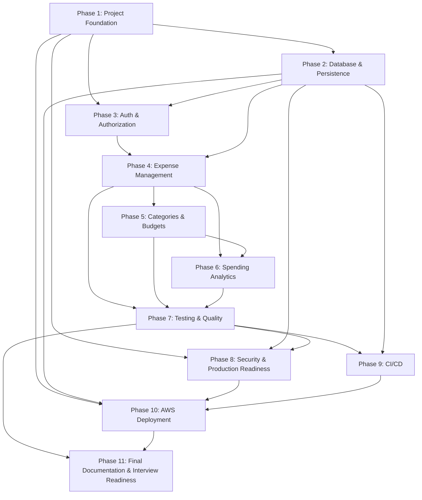

# Implementation Plan: Smart Expense Insights Platform

## Overview

This plan converts the approved design into an incremental, dependency-ordered sequence of coding tasks for a production-quality NestJS + Express (TypeScript) API, backed by PostgreSQL via Prisma, and deployable both locally and to AWS (API Gateway → Lambda) from a single, non-divergent codebase.

The work is organized into 11 phases. Each phase begins with a preamble stating its **Objective**, **Dependencies**, **Acceptance criteria**, **Testing/validation**, and **Documentation updates**, followed by concrete implementation, test, and documentation sub-tasks. Every sub-task references the specific requirements it implements (granular sub-requirement notation, e.g. `_Requirements: 4.1, 4.6_`) and, where relevant, the design Correctness Properties it validates (e.g. `_Validates: Property 16_`).

All 32 Correctness Properties from the design are implemented as `fast-check` property-based tests (minimum 100 iterations), each tagged `// Feature: smart-expense-insights-platform, Property N`. Auth/isolation properties live in the Auth phase, expense properties in the Expense phase, and so on; validation/error/logging/config properties are consolidated in Testing & Quality and Security phases. API documentation (OpenAPI/Swagger decorators, README updates) is produced alongside each phase, then consolidated for interview-readiness in the final phase.

Conventions used throughout:
- Money is `Decimal @db.Decimal(12,2)` end-to-end; the effective minimum amount is `0.01` (per design Ambiguity §11).
- Global cross-cutting behavior is applied through a single `configureApp()` so local and Lambda paths are byte-for-byte equivalent (Req 16.5).
- Tasks marked with `*` are optional (tests) and can be skipped for a faster MVP; top-level tasks are never optional.

## Tasks

- [x] 1. Project Foundation
  - **Objective:** Scaffold the NestJS + TypeScript project, establish the module/folder structure from the design §Project Structure, wire fail-fast environment configuration, and provide the single-codebase bootstrap that serves both local (`app.listen`) and AWS Lambda (`serverless-express` handler) paths through one shared `configureApp()`.
  - **Dependencies:** None (foundational).
  - **Acceptance criteria:** Project compiles; `configureApp()` centralizes global pipes/filters/interceptors/guards; app boots locally via `app.listen(PORT)` and exposes a Lambda `handler`; configuration is validated at startup and fails fast on missing/invalid keys; correlation-id middleware and structured logging skeleton are in place.
  - **Testing/validation:** Unit tests for the env-validation schema (missing/empty/whitespace/type-mismatch keys) and a bootstrap smoke test that `configureApp()` registers the expected global providers.
  - **Documentation updates:** Create `.env.example` enumerating every required key; initial `README.md` with project overview, prerequisites, and local-run instructions; Swagger/OpenAPI bootstrap mounted at `/api/v1/docs`.

  - [x] 1.1 Scaffold NestJS project and TypeScript/build config
    - Initialize the NestJS + Express project (TypeScript) with `tsconfig.json`, `nest-cli.json`, and `src/main.ts`/`src/app.module.ts` stubs
    - Create the full directory skeleton per design §Project Structure (`src/config`, `src/common/{filters,interceptors,guards,middleware,logging,decorators}`, `src/prisma`, `src/auth`, `src/users`, `src/categories`, `src/expenses`, `src/budgets`, `src/analytics`, `src/health`, `prisma/`, `test/{unit,properties,e2e}`)
    - _Requirements: 16.1; C1, C2_

  - [x] 1.2 Author `package.json` with pinned dependencies and single-command test runner
    - Add exact-pinned dependencies (NestJS, Express adapter, Prisma, class-validator/class-transformer, passport-jwt, argon2/bcrypt, Joi or Zod, fast-check, Jest, Supertest, `@codegenie/serverless-express`) with a committed lockfile
    - Define a single documented `npm test` script that runs the full suite, and `build`/`start`/`prisma` scripts referenced by the design
    - _Requirements: 17.1; C1, C2, C3_

  - [x] 1.3 Implement environment configuration module with fail-fast schema validation
    - Create `src/config/config.module.ts` (`@nestjs/config`) and `src/config/env.validation.ts` (Joi/Zod) validating `RUNTIME_ENV`, `PORT`, `DATABASE_URL`, `JWT_SECRET`, `JWT_EXPIRES_IN=3600`, `PLATFORM_TIMEZONE`, `LOG_LEVEL`, and lockout params
    - Read config before the app accepts requests; terminate startup and emit an error naming each missing/empty/whitespace key and, for type mismatches, the expected type
    - _Requirements: 15.1, 15.2, 15.3, 15.4, 15.5_

  - [x] 1.4 Implement single-codebase bootstrap (local listen + Lambda handler) and `configureApp()`
    - Implement `configureApp(app)` as the single source of truth applying the global `ValidationPipe`, `AllExceptionsFilter`, logging/response interceptors, and guards
    - In `main.ts`, branch on `RUNTIME_ENV`: local path calls `app.listen(PORT)` and aborts with a clear binding error if the port is in use; AWS path exports a cached `handler` via `@codegenie/serverless-express` using `app.init()`
    - _Requirements: 16.1, 16.2, 16.3, 16.5; C4, C5_

  - [x] 1.5 Implement correlation-id middleware and structured logging skeleton
    - Create `src/common/middleware/correlation-id.middleware.ts` that reads an inbound correlation header or generates a UUID, storing it in request-scoped context
    - Create `src/common/logging/logger.ts` structured JSON logger skeleton with severity levels {DEBUG, INFO, WARN, ERROR} and a redaction serializer placeholder for sensitive keys
    - _Requirements: 14.1, 14.2, 14.6_

  - [x]* 1.6 Write unit tests for env validation and bootstrap wiring
    - Test that missing/empty/whitespace/type-mismatch config keys terminate startup with a key-identifying error
    - Test that `configureApp()` registers the expected global pipe, filter, and interceptors
    - _Requirements: 15.2, 15.3, 15.5, 16.5_

  - [x] 1.7 Create `.env.example`, initial README, and Swagger bootstrap
    - Add `.env.example` listing every required configuration key with placeholder values
    - Write initial `README.md` (overview, prerequisites, local-run steps) and mount OpenAPI/Swagger at `GET /api/v1/docs`
    - _Requirements: 15.4, 18.1_

- [x] 2. Database & Persistence
  - **Objective:** Define the Prisma schema for `User`, `Category`, `Expense`, `Budget`, and `LoginAttempt` with `Decimal(12,2)` money, unique indexes, foreign keys, and performance indexes; implement `PrismaModule`/`PrismaService` with a cached client and a 10s connect timeout mapped to a `DB_UNAVAILABLE` error; and set up migrations and a seed script.
  - **Dependencies:** Phase 1 (config module supplies `DATABASE_URL`; module wiring exists).
  - **Acceptance criteria:** `prisma generate` and `prisma migrate` succeed; schema enforces case-insensitive email uniqueness, per-user category name uniqueness, category-delete restriction, and two-decimal money precision; `PrismaService` caches the client across warm invocations and surfaces `DB_UNAVAILABLE` when a connection cannot be established within 10s.
  - **Testing/validation:** Unit tests for the connect-timeout → `DB_UNAVAILABLE` mapping and for schema-level constraints (unique indexes, restrict-on-delete) exercised via migrations against a test DB.
  - **Documentation updates:** Document the data model (entities, constraints, indexes) and migration/seed commands in the README.

  - [x] 2.1 Author `prisma/schema.prisma` entities, enums, constraints, and indexes
    - Define `User` (`emailCi` unique), `Category` (unique `(userId, nameCi)`), `Expense` (`amount Decimal(12,2)`, `currency`, `date`, `description` ≤500 nullable), `Budget` (`limitAmount Decimal(12,2)`, `period` enum weekly|monthly|yearly, nullable `categoryId`), and `LoginAttempt` (email, failedCount, windowStart, lockedUntil)
    - Add FKs with `onDelete: Restrict` for `Expense.categoryId`, and performance indexes `Expense(userId,date)`, `Expense(userId,categoryId)`, `Budget(userId)`, `Category(userId)`
    - _Requirements: 1.2, 8.1, 8.3, 8.7; 4.1, 6.1, 9.1, 11.5_

  - [x] 2.2 Implement `PrismaModule` and `PrismaService` with cached client and 10s connect-timeout mapping
    - Create `src/prisma/prisma.service.ts` extending `PrismaClient` with `onModuleInit`/`onModuleDestroy`, instantiated once and cached in module scope for warm Lambda reuse
    - Bound connection attempts to 10s and map failures to a `DB_UNAVAILABLE` error leaving persisted data unchanged
    - _Requirements: 16.4; C3, C6_

  - [x] 2.3 Configure migrations and seed script
    - Wire `prisma migrate dev` (local authoring) and `prisma migrate deploy` (non-interactive CI/AWS) scripts; generate the initial migration
    - Create `prisma/seed.ts` with deterministic seed data for local development and tests
    - _Requirements: 16.4_

  - [ ]* 2.4 Write unit/integration tests for persistence layer
    - Test the 10s connect-timeout maps to `DB_UNAVAILABLE`
    - Test schema constraints via migrations: `emailCi` uniqueness, `(userId, nameCi)` uniqueness, and category delete-restrict when referenced
    - _Requirements: 16.4, 1.2, 8.3, 8.7_

  - [x] 2.5 Document data model and DB commands in README
    - Add a Data Model section (entities, constraints, indexes) and document migrate/seed commands
    - _Requirements: 18.1_

- [x] 3. Authentication & Authorization
  - **Objective:** Implement secure registration and login (argon2id/bcrypt with unique per-user salt), JWT issuance with exactly 3600s expiry, per-email login lockout backed by the shared `LoginAttempt` store, and the authorization layer (`JwtAuthGuard`, `OwnershipGuard`, owner-scoped queries) with `@Public`/`@CurrentUser` decorators.
  - **Dependencies:** Phase 1 (config, bootstrap, logging) and Phase 2 (`User`/`LoginAttempt` persistence).
  - **Acceptance criteria:** Registration enforces email/password policy and case-insensitive uniqueness; passwords stored only as unique salted hashes; login issues a 3600s JWT, returns a non-disclosing error on bad credentials, and locks an email for 900s after 5 failures within 15 minutes; protected routes reject missing/expired/malformed tokens; non-owners cannot access single resources or see others' collections.
  - **Testing/validation:** Property tests 6–15 (isolation, auth-required, invalid token, token expiry, non-disclosure, lockout, hashing, registration validation, email uniqueness); unit tests for empty-credential rejection.
  - **Documentation updates:** Swagger decorators for `/auth/register` and `/auth/login` (request/response schemas, success + failure examples); README auth section.

  - [x] 3.1 Implement `UsersModule` and password hashing
    - Create user persistence and credential records; implement a `PasswordHasher` using argon2id (or bcrypt) generating a unique per-user salt, never storing plaintext
    - _Requirements: 1.5_
    - _Validates: Property 13_

  - [x] 3.2 Implement registration endpoint with DTO validation and case-insensitive uniqueness
    - Create `AuthController` register route and `RegisterDto` enforcing RFC 5322 email (3–254 chars) and password 8–128 chars with upper/lower/digit/special
    - Enforce case-insensitive email uniqueness via `emailCi`; reject duplicates with a conflict error without creating or altering an existing user
    - _Requirements: 1.1, 1.2, 1.3, 1.4_
    - _Validates: Property 14, Property 15_

  - [x] 3.3 Implement login, JWT issuance, and `TokenService`
    - Create login route and `LoginDto`; verify credentials against the stored hash and return a generic non-disclosing error on mismatch; reject missing/empty email or password before verification
    - Implement `TokenService` issuing a JWT signed with `JWT_SECRET` with `exp = iat + 3600s`
    - _Requirements: 2.1, 2.2, 2.3, 2.4_
    - _Validates: Property 10, Property 11_

  - [x] 3.4 Implement login lockout via shared `LoginAttempt` store
    - Track consecutive failures per normalized email with a 15-minute window; after 5 failures lock the email for 900s and reject further attempts (including correct credentials) with an account-locked error; reset the counter on success/window expiry
    - _Requirements: 2.7_
    - _Validates: Property 12_

  - [x] 3.5 Implement `JwtAuthGuard`, `OwnershipGuard`, decorators, and owner-scoped query helper
    - Create global `JwtAuthGuard` (opt-out via `@Public()`) rejecting missing/expired/malformed tokens; `OwnershipGuard` for `/:id` routes mapping non-owner to a not-found/authorization response without disclosing existence
    - Add `@Public()` and `@CurrentUser()` decorators and a shared owner-scoped query pattern (`userId = currentUser.id`)
    - _Requirements: 2.5, 2.6, 3.1, 3.2, 3.3, 3.4, 3.5_
    - _Validates: Property 6, Property 7, Property 8, Property 9_

  - [ ]* 3.6 Write property test — data isolation (single-resource access/mutation)
    - `// Feature: smart-expense-insights-platform, Property 6` (fast-check, ≥100 runs): user B denied read/update/delete of A's Expense/Category/Budget, no data leaked, resource unchanged
    - _Requirements: 3.1, 3.2, 5.8, 6.6, 7.3, 8.6, 9.9, 10.4_
    - _Validates: Property 6_

  - [ ]* 3.7 Write property test — data isolation (collections)
    - `// Feature: smart-expense-insights-platform, Property 7` (fast-check, ≥100 runs): collection responses contain only the requesting user's records; empty when none
    - _Requirements: 3.3, 5.2, 8.4, 9.6, 11.3_
    - _Validates: Property 7_

  - [ ]* 3.8 Write property tests — authentication required and invalid token rejected
    - `// Feature: smart-expense-insights-platform, Property 8`: no-token request to protected route rejected, operation not performed
    - `// Feature: smart-expense-insights-platform, Property 9`: expired/malformed/bad-signature token rejected, operation not performed
    - _Requirements: 2.5, 2.6, 3.4, 3.5, 5.9_
    - _Validates: Property 8, Property 9_

  - [ ]* 3.9 Write property tests — token expiry, non-disclosure, lockout
    - `// Feature: smart-expense-insights-platform, Property 10`: issued token `exp` is exactly 3600s after issuance
    - `// Feature: smart-expense-insights-platform, Property 11`: wrong-email vs wrong-password rejections are identical
    - `// Feature: smart-expense-insights-platform, Property 12`: 5 failures within 15 min locks email for 900s
    - _Requirements: 2.2, 2.4, 2.7_
    - _Validates: Property 10, Property 11, Property 12_

  - [ ]* 3.10 Write property tests — password hashing, registration validation, email uniqueness
    - `// Feature: smart-expense-insights-platform, Property 13`: stored credential ≠ plaintext, verifies against plaintext, two users with same password have different hashes
    - `// Feature: smart-expense-insights-platform, Property 14`: invalid email/password rejected with field-specific error, no user created
    - `// Feature: smart-expense-insights-platform, Property 15`: case-variant email registration yields conflict, exactly one user exists
    - _Requirements: 1.2, 1.3, 1.4, 1.5_
    - _Validates: Property 13, Property 14, Property 15_

  - [x] 3.11 Add Swagger docs for auth endpoints and README auth section
    - Annotate register/login with request/response schemas, success and at least one failure representation
    - _Requirements: 18.1, 18.2, 18.3_

- [x] 4. Expense Management
  - **Objective:** Implement the Expenses module — create, read (single + list with date-range/category filter, pagination, descending-date ordering), update, and delete — with DTO validation for amount precision/currency/date, category-ownership checks, and owner-scoped operations.
  - **Dependencies:** Phase 3 (auth guards, ownership, `@CurrentUser`) and Phase 2 (`Expense`/`Category` persistence).
  - **Acceptance criteria:** Valid expenses are created with a unique id and returned; invalid amount/currency/date/category and unknown fields are rejected without mutation; single-resource reads/updates/deletes are owner-scoped with not-found/authorization semantics; list results are filtered, ordered by date descending, and paginated (limit 1–100 default 20, offset ≥0 default 0).
  - **Testing/validation:** Property tests 16–21 (create/read round-trip, update round-trip, delete round-trip, input validation, list filter/order/pagination, malformed-parameter rejection).
  - **Documentation updates:** Swagger decorators for all expense endpoints (query params, body, response schemas, failure examples); README expense section.

  - [x] 4.1 Implement `ExpensesModule` create with DTO validation and category-ownership check
    - Create `CreateExpenseDto` enforcing amount `0.01…999,999,999.99` at most two decimals, ISO 4217 currency, valid non-future date, optional description ≤500 chars; verify the referenced category exists and is owned by the user
    - Create the expense owned by the user and return it with a unique identifier
    - _Requirements: 4.1, 4.2, 4.3, 4.4, 4.5, 4.6_
    - _Validates: Property 16, Property 19_

  - [x] 4.2 Implement expense retrieval (single + list with filter/pagination/ordering)
    - Implement `GET /:id` (owner-scoped, not-found vs authorization) and `ListExpensesQueryDto` with inclusive date range, owner-scoped category filter, pagination (limit 1–100 default 20, offset ≥0 default 0), default descending date ordering, empty list when no match
    - Reject malformed/out-of-range list parameters identifying the invalid parameter
    - _Requirements: 5.1, 5.2, 5.3, 5.4, 5.5, 5.6, 5.7, 5.8, 5.9, 5.10_
    - _Validates: Property 20, Property 21_

  - [x] 4.3 Implement expense update (owner-scoped) with validation
    - Implement `PATCH /:id` with `UpdateExpenseDto` enforcing amount/precision/description limits and category ownership; apply changes only for the owner; not-found for missing id; authorization error for non-owner; no mutation on invalid input
    - _Requirements: 6.1, 6.2, 6.3, 6.4, 6.5, 6.6_
    - _Validates: Property 17, Property 19_

  - [x] 4.4 Implement expense deletion (owner-scoped)
    - Implement `DELETE /:id` removing the owner's expense with a confirmation response; not-found for missing/invalid id; authorization error for non-owner with the expense retained
    - _Requirements: 7.1, 7.2, 7.3_
    - _Validates: Property 18_

  - [ ]* 4.5 Write property tests — expense create/read, update, delete round-trips
    - `// Feature: smart-expense-insights-platform, Property 16`: create then read as owner returns same fields + unique id
    - `// Feature: smart-expense-insights-platform, Property 17`: valid update reflected on subsequent read
    - `// Feature: smart-expense-insights-platform, Property 18`: delete then read yields not-found
    - _Requirements: 4.1, 4.6, 5.1, 6.1, 7.1_
    - _Validates: Property 16, Property 17, Property 18_

  - [ ]* 4.6 Write property tests — expense input validation and list filter/order/pagination
    - `// Feature: smart-expense-insights-platform, Property 19`: invalid amount/currency/date/unowned-category rejected with field-specific error, no create/modify
    - `// Feature: smart-expense-insights-platform, Property 20`: list results match all filters, ordered date-desc, length ≤ limit at offset, inclusive boundaries
    - `// Feature: smart-expense-insights-platform, Property 21`: malformed list params rejected naming the parameter, no expenses returned
    - _Requirements: 4.2, 4.3, 4.5, 6.2, 6.4, 5.2, 5.3, 5.4, 5.5, 5.10_
    - _Validates: Property 19, Property 20, Property 21_

  - [x] 4.7 Add Swagger docs for expense endpoints and README expense section
    - Annotate create/list/get/update/delete with params, body, response schemas, and failure examples
    - _Requirements: 18.1, 18.2, 18.3_

- [x] 5. Categories & Budgets
  - **Objective:** Implement the Categories module (trim/uniqueness/dependency-guarded delete) and the Budgets module (create/list/update/delete plus budget status/tracking computation), with DTO validation.
  - **Dependencies:** Phase 4 (expense references drive category-delete guard and budget scoping) and Phases 2–3.
  - **Acceptance criteria:** Categories enforce trimmed 1–100 char names, case-insensitive per-user uniqueness, and delete-only-when-unreferenced; budgets validate limit/period/category-scope and support owner-scoped CRUD; budget status returns limit, total in-scope in-period spend, remaining, and within-limit/exceeded status with correct zero-spend behavior.
  - **Testing/validation:** Property tests 22–25 (category normalization/uniqueness, category deletion vs references, budget creation validation, budget status computation).
  - **Documentation updates:** Swagger decorators for category and budget endpoints (including `/budgets/:id/status`); README category/budget section.

  - [x] 5.1 Implement `CategoriesModule` CRUD with normalization, uniqueness, and dependency-guarded delete
    - Create/update with `CreateCategoryDto`/`UpdateCategoryDto` trimming names, enforcing 1–100 chars and case-insensitive per-user uniqueness (conflict on duplicate); list owner's categories (empty when none)
    - Update/delete owner-scoped with not-found/authorization; block deletion when referenced by expenses (conflict), delete when unreferenced
    - _Requirements: 8.1, 8.2, 8.3, 8.4, 8.5, 8.6, 8.7, 8.8_
    - _Validates: Property 22, Property 23_

  - [x] 5.2 Implement `BudgetsModule` management CRUD with validation
    - Create/update with limit `0.01…999,999,999.99` ≤2 decimals, period ∈ {weekly, monthly, yearly}, optional category scope owned by the user; list owner's budgets; owner-scoped update/delete with authorization error for non-owner
    - _Requirements: 9.1, 9.2, 9.3, 9.4, 9.5, 9.6, 9.7, 9.8, 9.9_
    - _Validates: Property 24_

  - [x] 5.3 Implement budget status/tracking computation
    - Implement `GET /budgets/:id/status` computing total in-scope in-period spend (Decimal), `remaining = limit − total`, status within-limit when `0 ≤ total ≤ limit` else exceeded with `exceeded = total − limit`; zero-spend returns total 0, remaining = limit, within-limit; period window derived from `PLATFORM_TIMEZONE`; not-found/authorization for missing or non-owned budget
    - _Requirements: 10.1, 10.2, 10.3, 10.4, 10.5_
    - _Validates: Property 25_

  - [ ]* 5.4 Write property tests — category normalization/uniqueness and deletion-vs-references
    - `// Feature: smart-expense-insights-platform, Property 22`: trimmed name accepted only when 1–100 chars and case-insensitively unique; whitespace/over-length/variant rejected, no create/modify
    - `// Feature: smart-expense-insights-platform, Property 23`: delete rejected (conflict) when referenced, succeeds when unreferenced
    - _Requirements: 8.1, 8.2, 8.3, 8.5, 8.7, 8.8_
    - _Validates: Property 22, Property 23_

  - [ ]* 5.5 Write property tests — budget creation validation and status computation
    - `// Feature: smart-expense-insights-platform, Property 24`: invalid limit/period/unowned-category rejected without create/modify
    - `// Feature: smart-expense-insights-platform, Property 25`: total equals arithmetic sum of in-scope in-period amounts, remaining/status/exceeded and zero-spend behavior correct
    - _Requirements: 9.3, 9.4, 9.5, 10.1, 10.2, 10.3, 10.5_
    - _Validates: Property 24, Property 25_

  - [x] 5.6 Add Swagger docs for category and budget endpoints and README section
    - Annotate category and budget CRUD + `/budgets/:id/status` with params, body, response schemas, and failure examples
    - _Requirements: 18.1, 18.2, 18.3_

- [x] 6. Spending Analytics
  - **Objective:** Implement the Analytics module for monthly and by-category insights using owner-scoped Decimal SUM aggregation, zero-on-empty behavior, invalid-range rejection, and natural exclusion of deleted expenses.
  - **Dependencies:** Phase 4 (expenses exist and can be deleted) and Phase 5 (categories exist for grouping).
  - **Acceptance criteria:** Monthly insight returns the arithmetic sum of the user's expenses within a month; by-category insight returns per-category sums within a range; totals are computed only from the requester's expenses; empty matches return all-zero totals with no error; invalid/missing/reversed ranges are rejected; deleted expenses are excluded from post-deletion computations.
  - **Testing/validation:** Property tests 1–5 (monthly sum invariant, by-category sum invariant, deletion excludes, empty yields zero, invalid range rejected).
  - **Documentation updates:** Swagger decorators for `/analytics/monthly` and `/analytics/by-category`; README analytics section.

  - [x] 6.1 Implement monthly and by-category analytics with owner-scoped Decimal aggregation
    - Implement `GET /analytics/monthly?month=YYYY-MM` (sum of amounts dated within the month) and `GET /analytics/by-category?startDate&endDate` (grouped Decimal SUM within range), owner-scoped; return all-zero totals with no error on empty match; deleted expenses excluded naturally
    - _Requirements: 11.1, 11.2, 11.3, 11.4, 11.5, 7.4_
    - _Validates: Property 1, Property 2, Property 3, Property 4_

  - [x] 6.2 Implement analytics range validation
    - Reject requests whose month/range is missing, malformed, or has a start date later than the end date with an invalid-range error, computing no insight
    - _Requirements: 11.6_
    - _Validates: Property 5_

  - [ ]* 6.3 Write property tests — analytics sum invariants and deletion exclusion
    - `// Feature: smart-expense-insights-platform, Property 1`: monthly total equals arithmetic sum of in-month owner expenses (tolerance 0.01)
    - `// Feature: smart-expense-insights-platform, Property 2`: each category group total equals arithmetic sum within range (tolerance 0.01)
    - `// Feature: smart-expense-insights-platform, Property 3`: deleting an expense decreases affected totals by exactly its amount (tolerance 0.01)
    - _Requirements: 11.1, 11.2, 11.5, 17.5, 7.4_
    - _Validates: Property 1, Property 2, Property 3_

  - [ ]* 6.4 Write property tests — empty yields zero and invalid range rejected
    - `// Feature: smart-expense-insights-platform, Property 4`: no-match month/range returns zero totals, no error
    - `// Feature: smart-expense-insights-platform, Property 5`: missing/malformed/reversed range rejected, no insight computed
    - _Requirements: 11.4, 11.6_
    - _Validates: Property 4, Property 5_

  - [x] 6.5 Add Swagger docs for analytics endpoints and README analytics section
    - Annotate monthly and by-category endpoints with params, response schemas, and failure examples
    - _Requirements: 18.1, 18.2, 18.3_

- [x] 7. Testing & Quality
  - **Objective:** Consolidate global validation-pipe behavior, the consistent error envelope with `AllExceptionsFilter`, and transactional rollback; ensure all 32 property tests are present; and add integration/e2e coverage (Supertest) including cross-user data-isolation and analytics sum-invariant, driven by a single-command runner with non-zero exit and a pass/fail summary.
  - **Dependencies:** Phases 1–6 (all endpoints and services exist to be validated end-to-end).
  - **Acceptance criteria:** Global `ValidationPipe` rejects invalid/unknown/missing fields identifying each; every error conforms to the single envelope with correct 4xx/5xx classes; internal errors leak no internals and roll back partial writes; the full suite runs via one command, exits non-zero on failure, and reports total/passed/failed with failing ids; at least one test exists per required functional area.
  - **Testing/validation:** Property tests 26–29 (validation totality, error envelope/status class, no-internal-leak, transactional rollback); verify Properties 30–32 are wired for Phase 8; e2e isolation (Req 17.4) and analytics sum-invariant (Req 17.5).
  - **Documentation updates:** Document the test DB strategy and the single-command test workflow in the README.

  - [x] 7.1 Wire global `ValidationPipe`, error envelope, `AllExceptionsFilter`, and transactional writes
    - Configure `ValidationPipe({ whitelist: true, forbidNonWhitelisted: true, transform: true, stopAtFirstError: false })` inside `configureApp()`; implement `AllExceptionsFilter` producing the single envelope with the error-code catalog and 4xx/5xx classes, stripping internals; wrap multi-step writes in `prisma.$transaction`
    - _Requirements: 12.1, 12.2, 12.3, 12.4, 13.1, 13.2, 13.3, 13.4, 13.5_
    - _Validates: Property 26, Property 27, Property 28, Property 29_

  - [ ]* 7.2 Write property tests — validation totality and error envelope/status class
    - `// Feature: smart-expense-insights-platform, Property 26`: invalid/extra/missing fields rejected without persistence, error identifies each field
    - `// Feature: smart-expense-insights-platform, Property 27`: single error envelope, code + ≤500-char message, 4xx client / 5xx server
    - _Requirements: 12.1, 12.2, 12.3, 12.4, 13.1, 13.3, 13.4_
    - _Validates: Property 26, Property 27_

  - [ ]* 7.3 Write property tests — internal-error non-leak and transactional rollback
    - `// Feature: smart-expense-insights-platform, Property 28`: forced internal failure returns only code+message, no stack/DB/path/secret
    - `// Feature: smart-expense-insights-platform, Property 29`: mid-processing failure persists no partial changes
    - _Requirements: 13.2, 13.5_
    - _Validates: Property 28, Property 29_

  - [ ]* 7.4 Write e2e/integration suite (Supertest) incl. cross-user isolation and analytics sum-invariant
    - Add at least one integration test per functional area (auth, expense create/read/update/delete, category management, budget tracking, analytics)
    - Add dedicated cross-user tests that user B cannot access user A's data (returns none of A's records) and an analytics sum-invariant test with 0.01 tolerance
    - _Requirements: 17.3, 17.4, 17.5_

  - [x] 7.5 Configure single-command runner, summary output, and non-zero exit; document test DB strategy
    - Ensure `npm test` runs the full suite (Jest + Supertest + fast-check), prints total/passed/failed, exits non-zero on any failure reporting each failing test id
    - Set up the ephemeral/test-DB strategy (`migrate deploy` before suite, per-test isolation) and document the workflow in the README
    - _Requirements: 17.1, 17.2, 17.6_

- [x] 8. Security & Production Readiness
  - **Objective:** Finalize structured JSON logging with correlation id and secret redaction, secret sourcing via configuration (SSM/Secrets Manager on AWS), a rate-limiting recommendation, dependency pinning/audit, `DB_UNAVAILABLE` handling, and a health endpoint.
  - **Dependencies:** Phase 1 (logging/config skeleton), Phase 2 (`DB_UNAVAILABLE`), Phase 7 (error envelope).
  - **Acceptance criteria:** Every request emits a structured log entry with method/route/status/correlation-id/ms-timestamp/severity; passwords/tokens/secrets are redacted in all log fields; secrets are sourced from configuration not source; `GET /api/v1/health` reports liveness/DB readiness and surfaces `DB_UNAVAILABLE`; dependencies are pinned with an audit step.
  - **Testing/validation:** Property tests 30–32 (log entry shape/correlation id, secret redaction, configuration fail-fast).
  - **Documentation updates:** README security & observability section (logging format, redaction, secret sourcing, rate-limiting recommendation, health endpoint).

  - [x] 8.1 Finalize structured logging interceptor with correlation id and secret redaction
    - Implement `LoggingInterceptor` emitting per-request entries (method, route, status, correlation id, ms-precision timestamp, severity {DEBUG,INFO,WARN,ERROR}); on error emit an ERROR entry with error category, correlation id, route; apply a redaction serializer replacing password/authorization/token/secret values with a fixed placeholder
    - _Requirements: 14.1, 14.2, 14.3, 14.4, 14.5, 14.6_
    - _Validates: Property 30, Property 31_

  - [x] 8.2 Implement secret sourcing and finalize config fail-fast
    - Source secrets from configuration (`.env` locally; SSM Parameter Store / Secrets Manager injected as env vars on AWS), never from source; ensure startup terminates and names each offending key (and expected type) on missing/invalid config
    - _Requirements: 15.2, 15.3, 15.4, 15.5_
    - _Validates: Property 32_

  - [x] 8.3 Implement health endpoint and DB-unavailability surfacing; add rate-limiting recommendation and dependency audit
    - Implement `HealthModule` `GET /api/v1/health` reporting liveness/DB readiness and mapping connection failure to `DB_UNAVAILABLE`
    - Add a coarse rate-limiting recommendation (`@nestjs/throttler` with shared store, or API Gateway throttling) and an `npm audit` dependency-hygiene step with pinned versions
    - _Requirements: 13.2, 16.4_

  - [ ]* 8.4 Write property tests — log shape/correlation id, secret redaction, config fail-fast
    - `// Feature: smart-expense-insights-platform, Property 30`: log entry contains method/route/status/non-empty correlation id/ms-timestamp/valid severity
    - `// Feature: smart-expense-insights-platform, Property 31`: no log field contains a raw secret; each replaced by the placeholder
    - `// Feature: smart-expense-insights-platform, Property 32`: absent/empty/whitespace/type-invalid config key terminates startup naming each offending key
    - _Requirements: 14.1, 14.2, 14.4, 14.5, 14.6, 15.2, 15.3, 15.5_
    - _Validates: Property 30, Property 31, Property 32_

  - [x] 8.5 Document security & observability in README
    - Document logging format, redaction, secret sourcing, rate-limiting recommendation, and the health endpoint
    - _Requirements: 18.1_

- [x] 9. CI/CD
  - **Objective:** Provide a CI pipeline configuration that builds, lints, generates the Prisma client, runs the full test suite with coverage and non-zero-exit enforcement, and includes a `migrate deploy` release step.
  - **Dependencies:** Phase 7 (single-command test runner + exit behavior) and Phase 2 (migrations).
  - **Acceptance criteria:** The pipeline config file(s) define stages for install, `prisma generate`, build, lint, test (coverage, fails the build on any test failure), and a gated `prisma migrate deploy` step; the pipeline invokes the single documented test command.
  - **Testing/validation:** Verified through the same single-command test runner integrated into the pipeline (Req 17.1, 17.6); no separate manual test steps.
  - **Documentation updates:** README CI/CD section describing pipeline stages and how they map to the test requirements.

  - [x] 9.1 Author CI pipeline configuration
    - Create pipeline config file(s) (e.g., GitHub Actions workflow) with stages: dependency install, `prisma generate`, `npm run build`, lint, and `npm test` with coverage that fails the build on non-zero exit
    - _Requirements: 17.1, 17.2, 17.6_

  - [x] 9.2 Add gated migration release step and document the pipeline
    - Add a `prisma migrate deploy` release stage (gated, non-interactive) for shared environments; document all stages and their requirement mapping in the README
    - _Requirements: 16.6, 18.1_

- [x] 10. AWS Deployment
  - **Objective:** Author the AWS SAM `template.yaml` (HTTP API + Lambda proxy `{proxy+}`, env vars, VPC config for RDS, least-privilege SSM IAM), configure Prisma engine `binaryTargets` for the Lambda runtime with correct bundling, and define the build/package/deploy flow plus `migrate deploy` against RDS, verifying behavior equivalence between local and Lambda.
  - **Dependencies:** Phase 1 (Lambda handler/bootstrap), Phase 2 (Prisma/RDS connectivity), Phase 8 (secret sourcing), Phase 9 (build/test in CI).
  - **Acceptance criteria:** `sam build`/`sam deploy` provision an HTTP API routing `ANY /{proxy+}` to the Lambda; the function runs in VPC private subnets to reach RDS with least-privilege SSM read; the Prisma engine `rhel-openssl-3.0.x` binary is bundled; migrations apply to RDS via `migrate deploy`; identical requests yield identical status/body/validation locally and on Lambda.
  - **Testing/validation:** Reuse the existing automated suite (behavior-equivalence assertions from `configureApp()`); a deployment smoke check of the health endpoint against the deployed API.
  - **Documentation updates:** README AWS deployment section (build/package/deploy flow, VPC/RDS/SSM notes, engine bundling, migration release).

  - [x] 10.1 Author SAM `template.yaml` and `samconfig.toml`
    - Define the Serverless Function (`Handler: dist/main.handler`, nodejs20.x), HTTP API event `ANY /{proxy+}`, environment variables (`RUNTIME_ENV=aws`, `DATABASE_URL`, `JWT_SECRET`, `PLATFORM_TIMEZONE`), VpcConfig (security group + private subnets), and least-privilege IAM (`ssm:GetParameter` scoped) plus `AWSLambdaVPCAccessExecutionRole`
    - _Requirements: 16.3, 16.6; C4, C6_

  - [x] 10.2 Configure Prisma engine binary targets and Lambda bundling
    - Set `binaryTargets` in `schema.prisma` to include `rhel-openssl-3.0.x`; ensure the engine and generated client are bundled into the deployment package (esbuild/`sam build`)
    - _Requirements: 16.3, 16.5; C4, C6_

  - [x] 10.3 Define build/package/deploy flow and RDS migration release
    - Script the flow: `prisma generate` → `npm run build` → `sam build` → `sam deploy` → `prisma migrate deploy` against RDS as a release step
    - _Requirements: 16.5, 16.6_

  - [ ]* 10.4 Add local-vs-Lambda behavior-equivalence verification
    - Add an automated check (reusing the suite through the shared `configureApp()` path) asserting identical response status/body/validation outcomes, plus a health-endpoint smoke check against the deployed API
    - _Requirements: 16.5_

  - [x] 10.5 Document AWS deployment in README
    - Document the build/package/deploy flow, VPC/RDS/SSM setup, engine bundling, and migration release
    - _Requirements: 18.1_

- [x] 11. Final Documentation & Interview Readiness
  - **Objective:** Consolidate the OpenAPI/Swagger endpoint documentation and README into a complete, interview-ready reference covering local run, AWS deploy, architecture overview, ADR summary, tradeoffs, and the resolutions of the design's ambiguities/risks.
  - **Dependencies:** Phases 1–10 (all endpoints, tests, and deployment artifacts exist and are documented per phase).
  - **Acceptance criteria:** Every endpoint has complete OpenAPI documentation (path, method, parameters, request/response schemas, success + at least one failure representation); the README consolidates local-run, AWS-deploy, architecture, ADR summary, and tradeoffs; ambiguities/risks and their resolutions are documented; interview-discussion notes are included.
  - **Testing/validation:** Verify the generated OpenAPI covers all implemented endpoints and that a request for a non-existent endpoint's docs returns a no-documentation response.
  - **Documentation updates:** This phase is the documentation consolidation itself.

  - [x] 11.1 Consolidate and verify complete OpenAPI/Swagger documentation
    - Ensure every endpoint's decorators describe path, method, each parameter, request body schema, and response schema with success + at least one failure representation; verify coverage and that unknown-endpoint doc requests return a no-documentation response
    - _Requirements: 18.1, 18.2, 18.3, 18.4, 18.5_

  - [x] 11.2 Finalize README: local run, AWS deploy, architecture, ADR summary, tradeoffs
    - Consolidate local-run and AWS-deploy instructions, an architecture overview, the ADR summary, and tradeoffs into the README
    - _Requirements: 18.1, 18.3, 18.4_

  - [x] 11.3 Document ambiguity/risk resolutions and interview-discussion notes
    - Document the resolutions of the design §Ambiguities (token revocation, currency/timezone handling, lockout-in-Lambda, cold start, connection exhaustion, DB-unavailability, idempotency, amount lower-bound) and add interview-discussion notes on the key decisions
    - _Requirements: 18.1_

## Notes

- Tasks marked with `*` are optional (property, unit, integration, and e2e tests) and can be skipped for a faster MVP; core implementation tasks are never marked optional.
- Each task references specific granular sub-requirements for traceability, and property-test tasks additionally reference the design Correctness Property they validate.
- All 32 Correctness Properties are covered: Properties 6–15 (Phase 3), 16–21 (Phase 4), 22–25 (Phase 5), 1–5 (Phase 6), 26–29 (Phase 7), 30–32 (Phase 8).
- Property-based tests use `fast-check` with a minimum of 100 iterations and are tagged `// Feature: smart-expense-insights-platform, Property N`.
- API documentation is produced alongside each phase (Swagger decorators as endpoints are built, per-phase README updates) and consolidated for interview-readiness in Phase 11.
- The single codebase serves both local (NestJS + Express on localhost + local PostgreSQL) and AWS (API Gateway + Lambda + RDS) via one shared `configureApp()` (Req 16.5).

## Task Dependency Graph (Mermaid)



## Task Dependency Graph

```json
{
  "waves": [
    { "id": 0, "tasks": ["1.1", "1.2"] },
    { "id": 1, "tasks": ["1.3", "1.5"] },
    { "id": 2, "tasks": ["1.4", "1.6", "1.7"] },
    { "id": 3, "tasks": ["2.1", "2.2"] },
    { "id": 4, "tasks": ["2.3", "2.4", "2.5"] },
    { "id": 5, "tasks": ["3.1", "3.2", "3.3"] },
    { "id": 6, "tasks": ["3.4", "3.5"] },
    { "id": 7, "tasks": ["3.6", "3.7", "3.8", "3.9", "3.10", "3.11"] },
    { "id": 8, "tasks": ["4.1", "4.2"] },
    { "id": 9, "tasks": ["4.3", "4.4"] },
    { "id": 10, "tasks": ["4.5", "4.6", "4.7"] },
    { "id": 11, "tasks": ["5.1", "5.2"] },
    { "id": 12, "tasks": ["5.3", "5.4", "5.5", "5.6"] },
    { "id": 13, "tasks": ["6.1", "6.2"] },
    { "id": 14, "tasks": ["6.3", "6.4", "6.5"] },
    { "id": 15, "tasks": ["7.1"] },
    { "id": 16, "tasks": ["7.2", "7.3", "7.4", "7.5"] },
    { "id": 17, "tasks": ["8.1", "8.2", "8.3"] },
    { "id": 18, "tasks": ["8.4", "8.5"] },
    { "id": 19, "tasks": ["9.1", "9.2"] },
    { "id": 20, "tasks": ["10.1", "10.2", "10.3"] },
    { "id": 21, "tasks": ["10.4", "10.5"] },
    { "id": 22, "tasks": ["11.1", "11.2", "11.3"] }
  ]
}
```
